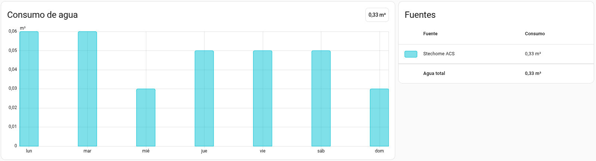

# stechome-ha-integration

Integración no oficial para Home Assistant que conecta con la web de Stechome y crea un sensor de consumo acumulado para agua caliente sanitaria (ACS).

La integración está pensada para registrar el consumo de ACS dentro del panel de Energía de Home Assistant.

## Índice

- [Vista del panel de Energía](#vista-del-panel-de-energía)
- [Características funcionales](#características-funcionales)
- [Limitaciones](#limitaciones)
- [Instalación](#instalación)
  - [Requisitos](#requisitos)
  - [Instalación con HACS (recomendado)](#instalación-con-hacs-recomendado)
  - [Instalación manual](#instalación-manual)
- [Configuración](#configuración)
  - [Añadir integración](#añadir-integración)
  - [Refresco automático diario](#refresco-automático-diario)
  - [Importación de histórico de datos](#importación-de-histórico-de-datos)
  - [Integración en el panel de Energía](#integración-en-el-panel-de-energía)
- [Cómo funciona internamente](#cómo-funciona-internamente)
- [FAQ](#faq)

## Vista del panel de Energía

## Características funcionales

- Crea un sensor de consumo acumulado para que el panel de Energía de Home Assistant calcule los consumos diarios de ACS.
- Actualización automática diaria configurable en las opciones de la integración.
- Importación de lecturas anteriores de hasta 90 días.

## Limitaciones

- Por ahora, únicamente se puede registrar el consumo de ACS. Próximamente se añadirá el consumo de calefacción.
- El consumo de agua **no se mide en tiempo real**, pues la API de Stechome publica la lectura a día vencido, es decir, sólo es posible ver el consumo total de un día anterior.
- La integración funciona cuando se tiene un único piso dentro del servicio de Stechome.

## Instalación

### Requisitos

- Home Assistant con `recorder` activo (activado por defecto).
- HACS, si se utiliza ese método de instalación.
- Cuenta válida en https://stechome.net.

### Instalación con HACS (recomendado)

1. Abre HACS en Home Assistant.
2. Entra en el menú de 3 puntos (arriba a la derecha) y elige `Custom repositories`.
3. En `Repository`, pega la URL de este repositorio:
	 - `https://github.com/jmprof/stechome-ha-integration`
4. En `Category`, selecciona `Integration`.
5. Pulsa `Add`.
6. Busca `Stechome` dentro de HACS e instálalo.
7. Reinicia Home Assistant.

### Instalación manual

1. Descarga el release y descomprímelo.
2. En Home Assistant, dentro de la carpeta `custom_components`, crea una carpeta llamada `stechome`.
3. Sube a esa carpeta el contenido de la carpeta `stechome`.
4. Reinicia Home Assistant.

Ten en cuenta que, con este método, la integración no se actualizará automáticamente.

## Configuración

### Añadir integración

1. Ve a `Settings > Devices & Services`.
2. Pulsa `Add Integration`.
3. Busca `Stechome`.
4. Introduce tu email y contraseña de Stechome.

Si todo va bien, se creará un dispositivo con sus sensores asociados.

### Refresco automático diario

Puedes configurar en las opciones de la integración:
- Hora diaria (`HH:MM`) usando la zona horaria de Home Assistant.
- Días hacia atrás (`1` a `7`) para refrescar desde ese punto hasta ayer.

Por defecto:
- Hora: `00:30`
- Días hacia atrás: `1` (sólo ayer)

### Importación de histórico de datos

1. Abre el dispositivo de Stechome.
2. En la sección de controles, selecciona:
	- Fecha inicio de importación.
	- Fecha fin de importación.
3. Pulsa el botón de importar ACS.

Consideraciones:

- El rango máximo permitido por importación es de 90 días.
- Los rangos solapados se normalizan por día y pueden reimportarse.

### Integración en el panel de Energía

1. Ve a `Settings > Dashboards > Energy`.
2. En la sección de agua, selecciona el sensor `ACS` de Stechome. No importa que su estado sea "Desconocido".

## Cómo funciona internamente

- La integración se refresca automáticamente una vez al día a la hora configurada.
- En cada refresco automático:
	- Inicia sesión en Stechome.
	- Consulta lecturas diarias del rango configurado (N días hasta ayer).
	- Reimporta el rango para mantener coherencia con posibles solapes.
	- Actualiza la lectura de la entidad ACS.
	- Actualiza la entidad en Home Assistant.

Esto permite que Home Assistant gestione estadísticas de largo plazo sin que tengas que recalcular nada manualmente.

## FAQ

**Me sale un error de autenticación**

> Verifica usuario y contraseña. Si ese no es el problema, puedes revisar los logs para ver respuesta la HTTP y el contenido devuelto por Stechome.

**El sensor `ACS` se muestra como "Desconocido"**

> Estoy trabajando en ello, de todas formas, no supone ningún problema para que el panel de Energía realice los calculos de consumo diarios.

**Tengo algunos días sin consumo**

> Revisa si ocurre lo mismo en la web de Stechome. Algunas veces tienen errores en sus lecturas. La integración sólo recoje los mismos datos que ellos publican.

**El primer día importado me aparece con un consumo muy alto**

> Home Assistant utiliza la diferencia entre las lecturas para calcular el consumo de un día. Como el primer día no tiene ninguno anterior, toma la lectura de ese día como lo que se consumió. El resto de días sí se calculan correctamente.